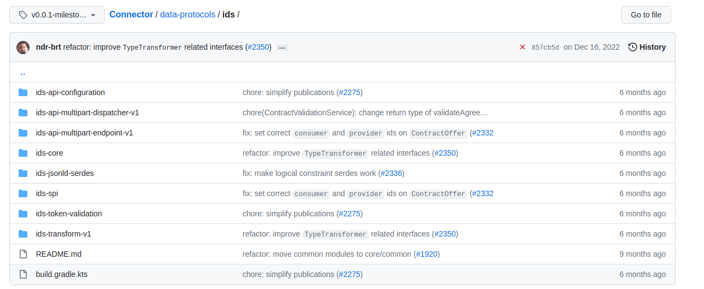
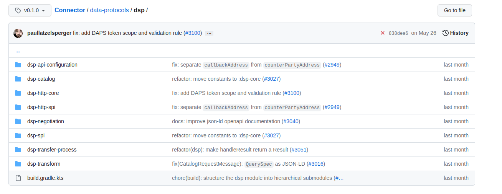
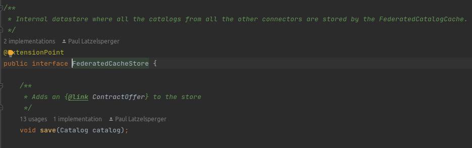
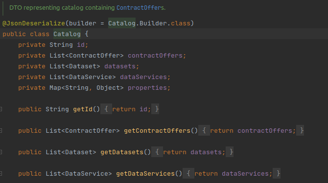
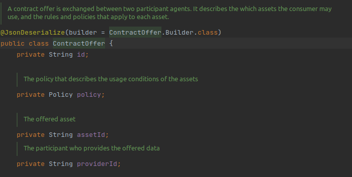
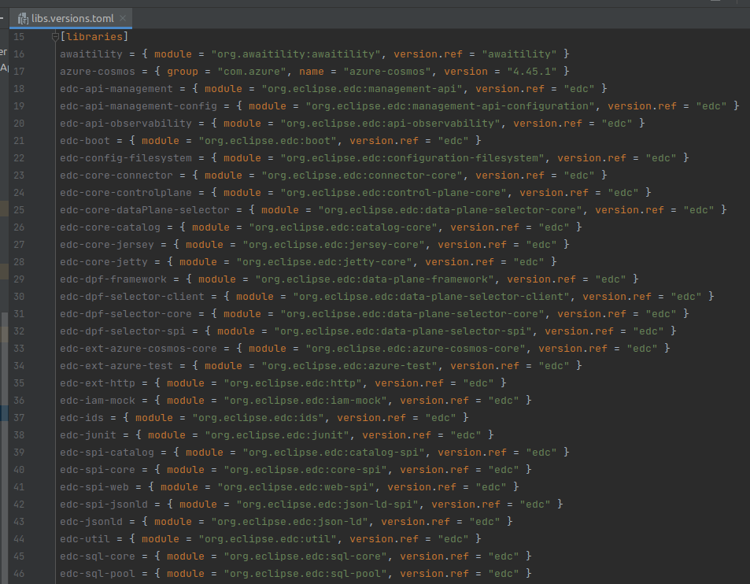
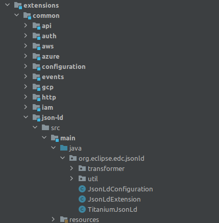

# Upgrade version impacts
## _Impacts to upgrade Federated Catalog to EDC version 0.1.0_

Some identified issues bellow:

### Protocol migrated from IDS to DSP

The protocol used in components communication are not more [IDS](https://github.com/International-Data-Spaces-Association/ids-specification) protocol. The version 0.1.X is using the [DPS](https://docs.internationaldataspaces.org/dataspace-protocol/overview/readme) protocol.

Version milestone-8:

Version 0.1.0:

### FederatedCacheStore now receive a Catalog object:
We need to create the catalog object and refactor the methods to use it.

Image:

### The Catalog object have new attributes:
We need to know if we will need to persist these new attributes and how.

Image:

### Into Catalog object, ContractOffers was modified and the date attributes is deleted:
We use offerEnd attribute to expire the contractOffer, and it not exists anymore. 
We need to know how we will do the contract expiration and change our implementations.

Image:

### The libraries structure was modified and some libraries does not exist anymore:

Image:

### The way to parser was modified and the infomodel does not exist anymore. Now the response is a Map using Titanium library:
We need to change our parser implementation.

Image:

