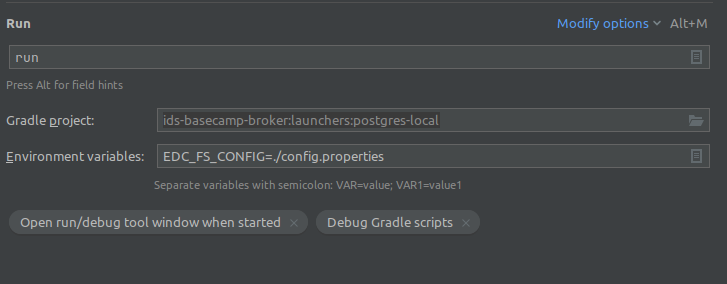

# PostgreSQL Local Laumcher

This document shows how to use the launcher postgresql-local, using a local postgresql instance.

## Dependencies

Run the following command to create the launcher dependencies (like postgresql):
```bash
./launchers/postgres-local/dependencies/run.sh
```

## CLI Execution

Run the following command to run the launcher:

```bash
./gradlew launchers:postgres-local:run -Dedc.fs.config=./launchers/postgres-local/config.properties 
```

## InteliJ IDEA Execution

Create a new run/debug configuration, of type gradle, and set the following parameters:

**Run:** ```run```<br>
**Gradle project:** ```ids-basecamp-broker:launchers:postgres-local```<br>
**Environment variables:** ```EDC_FS_CONFIG=./config.properties```<br>


